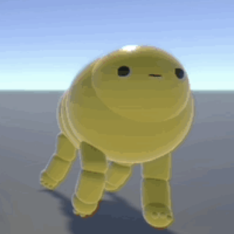

 

<!-- PROJECT LOGO -->

  
  <h1 align="center">TARS</h1>
  

    Totally Accurate Ragdoll Simulator 
     
  

 

# About
This project showcases a simple implementation of a physics-based character controller in Unity.

**Procedural Animation**

**Physics based Procedural Animation**

**Active Ragdoll**

 

(<a href="#top">back to top</a>)

 
